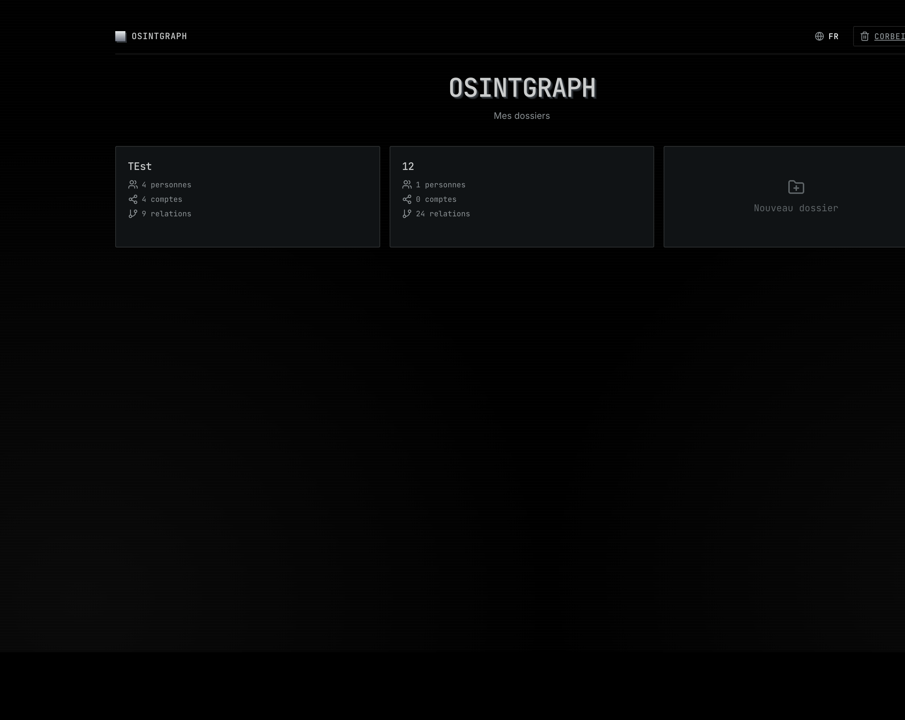
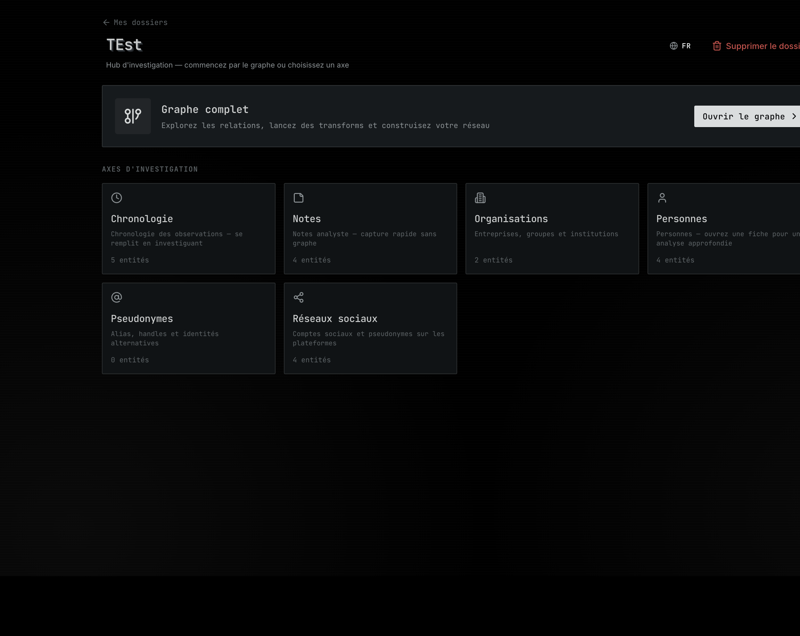
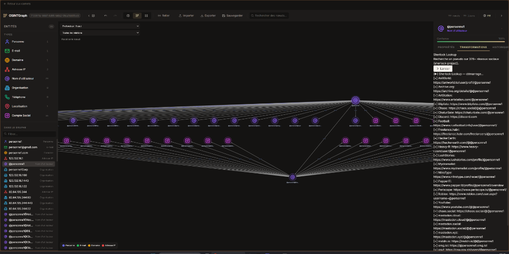

# OSINTGraph

> Desktop OSINT / Graph Intelligence Application — Maltego-inspired

**FR** — OSINTGraph organise vos investigations en **dossiers** et **carnets**, relie personnes, comptes et artefacts dans un **graphe relationnel**, et trace chaque fait avec **provenance** et niveaux de confiance. Sources ouvertes et données fournies par l'analyste uniquement.

**EN** — OSINTGraph structures investigations into **dossiers** and **carnets**, links people, accounts, and artifacts in a **relational graph**, and tracks every datum with **provenance** and confidence levels. Open sources and analyst-provided data only.

**Nouveau ?** → [`docs/GETTING_STARTED.md`](docs/GETTING_STARTED.md) · **Contribuer / fork** → [`CONTRIBUTING.md`](CONTRIBUTING.md)

## Mise à jour — Septembre 2026

- 🔍 **Recherche décès INSEE** — plugin `death_search`, modal fiche personne, demande d'actes encadrée ([`docs/DEATH_SEARCH.md`](docs/DEATH_SEARCH.md))
- 🔌 **10 plugins OSINT** — Sherlock, Maigret, Holehe, Shodan, DNS, WHOIS, SpiderFoot, etc. avec streaming WebSocket en temps réel
- 🐳 **Docker production** — déploiement React + API via `docker compose` ([`deploy/docker.md`](deploy/docker.md))
- ☁️ **UI Streamlit cloud** — accès distant simplifié + onboarding et bouton « Charger la démo » ([`deploy/streamlit-cloud.md`](deploy/streamlit-cloud.md))
- 📚 **Documentation revue** — guide [`GETTING_STARTED`](docs/GETTING_STARTED.md), workflow fork [`CONTRIBUTING.md`](CONTRIBUTING.md), captures README restaurées
- ⚙️ **Setup simplifié** — scripts `setup.ps1` / `setup.sh`, `npm run setup`, arrêt dev cross-platform (`dev:stop`)

## Aperçu / Preview

> *Les captures ci-dessous montrent l'interface **Matte & Vintage** (React) avec sauvegarde automatique.*

### Liste des dossiers (statistiques)



### Hub d'investigation (carnets)



### Graphe & transformations



## Modes d'utilisation

| Mode | Commande | Interface |
|------|----------|-----------|
| **Local (recommandé)** | `npm run dev` | React Matte & Vintage + Cytoscape (:5173) |
| **Desktop** | `cd frontend && npm run electron:dev` | Electron |
| **Docker (prod)** | `docker compose up --build` | React via nginx (:8080) + API (:8000) |
| **Streamlit Cloud** | `streamlit_app.py` sur share.streamlit.io | UI cloud simplifiée |
| **Preview Streamlit** | `npm run dev:streamlit` | Streamlit local (:8501) |

> L'UI **React** est la référence complète (transforms WebSocket, recherche décès INSEE, Electron). Streamlit sert l'accès cloud léger — voir [`deploy/streamlit-cloud.md`](deploy/streamlit-cloud.md).

## Installation rapide

### Windows

```powershell
git clone https://github.com/Hicham77500/OSINTGraph.git
cd OSINTGraph
.\scripts\setup.ps1
npm run dev
```

### macOS / Linux

```bash
git clone https://github.com/Hicham77500/OSINTGraph.git
cd OSINTGraph
./scripts/setup.sh
npm run dev
```

- Frontend : http://localhost:5173/
- Backend : http://127.0.0.1:8000/health

### Données de démo

```bash
cd backend && .venv/bin/python scripts/seed_test_dossier.py
# Windows : .venv\Scripts\python scripts\seed_test_dossier.py
```

## Docker (production)

```bash
cp .env.example .env
docker compose up --build
```

- Interface : http://localhost:8080  
- Guide : [`deploy/docker.md`](deploy/docker.md)

## Fonctionnalités

| Module | Description |
|--------|-------------|
| **Dossiers** | Investigations isolées avec métadonnées et accès rapide aux carnets |
| **Carnets** | Notes, chronologie, listes — typés selon le besoin d'investigation |
| **Graphe** | Canvas Cytoscape, transforms OSINT, navigation relationnelle |
| **Provenance** | Source, observation, evidence, confiance (CONFIRMED → CONTRADICTED) |
| **Notes** | Saisie datée, édition et suppression dans les carnets |
| **Import / Export** | Transfert de données (JSON/CSV) depuis/vers le graphe |
| **Recherche décès INSEE** | Fichier public des décès en France (depuis 1970) — React + plugin backend |
| **Auto-save** | Sauvegarde transparente et continue de l'investigation |
| **Corbeille** | Dossiers supprimés — restauration ou suppression définitive |

## Stack

- **Frontend** : Electron + React 18 + TypeScript + Vite + Cytoscape.js
- **Backend** : FastAPI + Python 3.11 + asyncio + SQLite
- **Realtime** : Socket.IO (via `main:asgi_app`)
- **Plugins OSINT** : `backend/plugins/` (auto-découverte via `plugin.json`)
- **Cloud optionnel** : Streamlit (`streamlit_app.py` + `ui/`)

*Planifié : Neo4j, Agent-OS orchestrator*

## Architecture

```
OSINTGraph/
  frontend/           React + Electron — UI référence (dev local, Docker)
  streamlit_app.py    Entry point Streamlit Cloud
  ui/                 Vues Streamlit (cloud / preview)
  backend/            FastAPI + plugins OSINT + SQLite
  deploy/             Guides Docker + Streamlit Cloud
  docs/               Guides utilisateur (GETTING_STARTED, PROJECT_CONTEXT…)
  scripts/            setup.ps1 / setup.sh
```

**Contexte** — [`AGENTS.md`](AGENTS.md) · [`docs/PROJECT_CONTEXT.md`](docs/PROJECT_CONTEXT.md) · [`docs/DEATH_SEARCH.md`](docs/DEATH_SEARCH.md)

## Plugins OSINT (production)

| Plugin | Input | Output | Notes |
|--------|-------|--------|-------|
| DNS Lookup | Domain | IP | — |
| Whois Lookup | Domain | Organization | — |
| Shodan Lookup | IP, Domain | Organization, Location, Port | clé API |
| Sherlock Lookup | Username | Social Account | — |
| IP Geolocation | IP | Location, Organization | — |
| Phone Lookup | Phone | Location, Organization | — |
| Holehe Lookup | Email | Username | — |
| Maigret Lookup | Username | Social Account | — |
| SpiderFoot Scan | Domain, IP, Email… | Multi-types | Docker optionnel |
| **Death Search (INSEE)** | Person | Person, Location | Parquet / DuckDB |

> **HIBP** : code legacy dans `backend/transforms/hibp_lookup.py` — non migré en plugin. Utiliser Holehe ou un plugin dédié si besoin.

## Configuration recherche décès (optionnel)

```bash
DEATH_RECORDS_PATH=/chemin/vers/parts
VITE_DEATH_RECORDS_BASE_URL=https://pub-xxxxx.r2.dev/parts
```

Voir [`docs/DEATH_SEARCH.md`](docs/DEATH_SEARCH.md).

## Tests

```bash
cd backend && .venv/bin/pytest
cd frontend && npm test
```

## Sécurité

```bash
cd backend && .venv/bin/pip-audit
npm audit
```

## Agent context

See [`AGENTS.md`](AGENTS.md) for AI agent guidelines.
